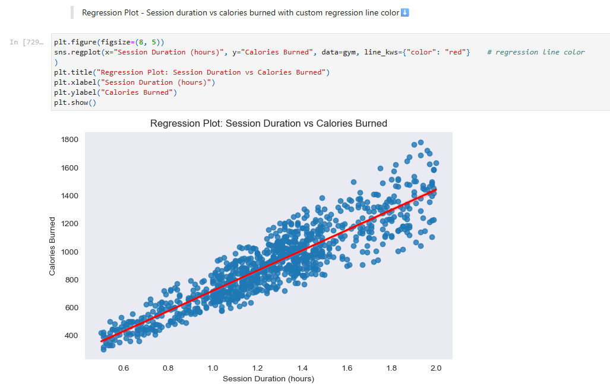
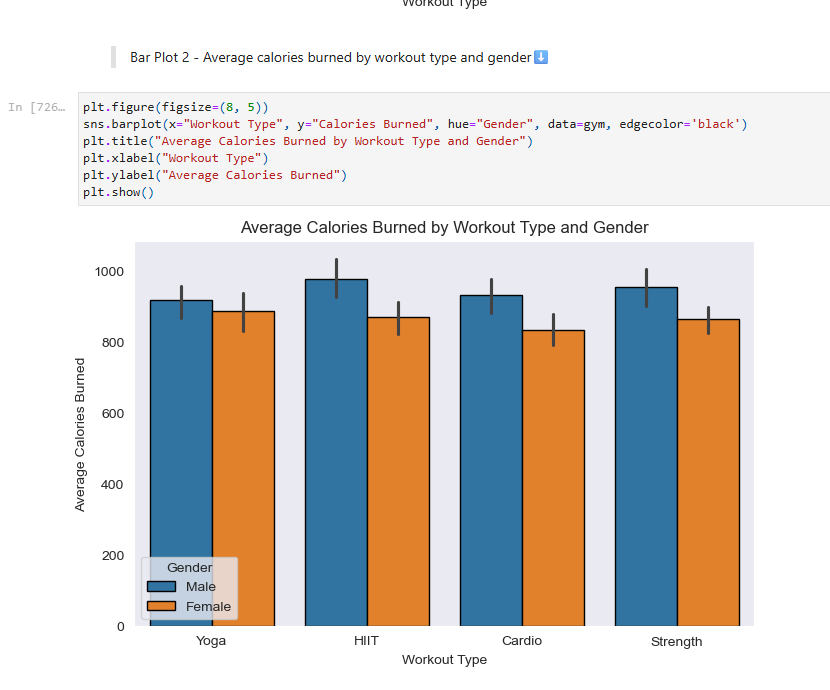

# Gym Members Workout EDA

**Course:** Scientific Data Analysis — Fall 2025
**Dataset:** [Gym Members Exercise Dataset](https://www.kaggle.com/datasets/valakhorasani/gym-members-exercise-dataset) (973 members, 15 variables)

---

## Overview

This project explores whether workout session duration directly predicts calories burned, and how other factors like workout type, experience level, and gender interact with that relationship. The analysis was done entirely in Python using a Jupyter Notebook.

---

## Visualizations

---

## What I Did

- **Cleaned and prepared** the data: renamed columns, encoded experience levels (1/2/3 → Beginner/Intermediate/Expert), binned continuous variables, and verified no missing values or duplicates
- **Performed EDA**: summary statistics, category counts, top-10 rankings, boolean filtering, and a derived "calories per hour" efficiency metric
- **Grouped analysis**: compared average calories burned across workout types, genders, and experience levels using `groupby`
- **Visualized** the data with histograms, scatter plots, a regression plot, bar charts, a boxplot, and a correlation heatmap using seaborn and matplotlib

---

## Key Findings

- Longer sessions do correlate with higher calorie burn, but the relationship isn't the whole story
- HIIT burns the most calories on average (~926), followed by Strength (~911)
- Expert-level members burn significantly more than beginners (~1265 vs ~725 avg calories), suggesting intensity and efficiency matter as much as time
- Males consistently burned more calories than females across all workout types

---

## What I Learned

- How to structure a full EDA pipeline from raw data to insight
- Using `pandas` for data wrangling (`groupby`, `cut`, boolean indexing, derived columns)
- Building and interpreting seaborn visualizations (regression plots, heatmaps, boxplots)
- How to ask a focused research question and let the data guide the analysis
- Practical use of generative AI as a coding assistant (disclosed in notebook)

---

## Tools

Python · pandas · NumPy · seaborn · matplotlib · Jupyter Notebook
